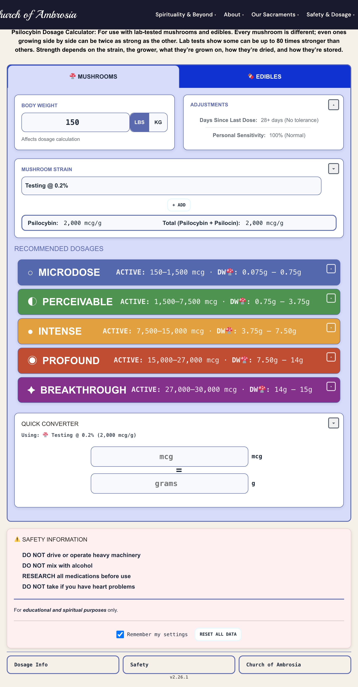
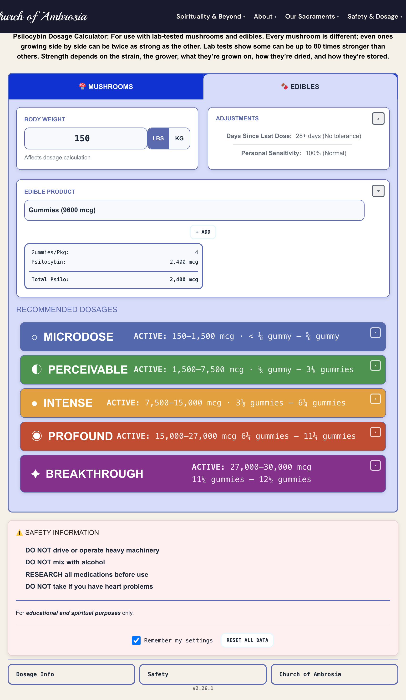
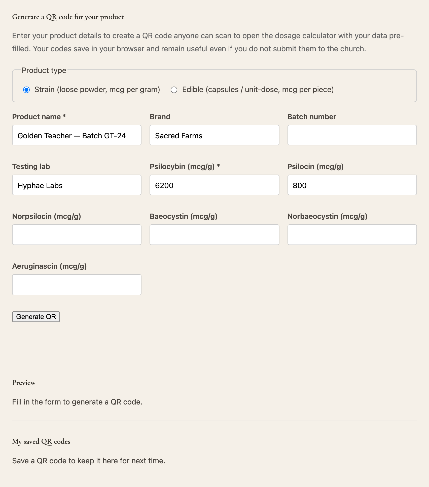

# Ambrosia Dosage Calculator


A WordPress plugin for the Church of Ambrosia that calculates psilocybin sacrament
dosages from lab-tested potency data. It factors in body weight, tolerance, personal
sensitivity, and the specific compound profile of each strain or edible.

For educational and spiritual purposes only.

## Screenshots

**Mushroom calculator** with per-strain potency and five experience levels:



**Edible calculator** in product-specific units (gummies, capsules, and so on):



**Maker QR generator**, where a producer creates a QR code from their own product data:



## What it does

- Mushroom dosing in grams from per-strain potency (psilocybin plus psilocin, in
  micrograms per gram).
- Edible dosing in product-specific units: gummies, capsules, packets, bars, cups,
  droppers, rounded to eighths of a unit.
- Five experience levels from microdose to breakthrough, adjusted for tolerance (days
  since last dose) and personal sensitivity.
- QR codes: short URLs for church products, plus a public maker page where producers
  generate their own codes that open the calculator pre-filled.
- Admin management of strains and edibles, CSV and Google Sheets import, and a member
  submission queue.
- Self-updates from GitHub Releases.

## How dosing works

A target dose in micrograms is derived from body weight and the selected experience
level, then adjusted for tolerance and personal sensitivity:

```
mcg_needed = mcg_per_lb x weight_lbs x tolerance_multiplier x sensitivity_multiplier
```

- Mushrooms: `grams = mcg_needed / (psilocybin + psilocin per gram)`.
- Edibles: `units = mcg_needed / (psilocybin + psilocin per piece)`, rounded to eighths.

Tolerance ramps from 100% at 28 or more days since the last dose up to 200% at one day.
Psilocybin and psilocin drive the calculation; norpsilocin, baeocystin, norbaeocystin,
and aeruginascin are tracked for display.

## Shortcodes

| Shortcode | Purpose |
| --- | --- |
| `[dosage_calculator]` | The dosage calculator. |
| `[dosage_calculator_qr_maker]` | A page where makers generate QR codes for their products. |

The attributes for `[dosage_calculator]` (template, default tab, pre-selected product,
and so on) are documented in the admin dashboard under **Dosage Calc**.

## Installation

1. Download the latest `ambrosia-dosage-calculator-vX.Y.Z.zip` from the
   [Releases](https://github.com/daveambrosia/mushroom-dosage-calc/releases) page.
2. In WordPress, go to **Plugins, Add New, Upload Plugin**, choose the zip, and activate.
3. Configure under **Dosage Calc** in the admin menu, then add `[dosage_calculator]` to a
   page.

Once installed, the plugin checks GitHub Releases for new versions and offers updates on
the WordPress Plugins screen like any other plugin.

## Development

See [README-DEV.md](README-DEV.md) for the build, test, and release workflow. Every change
is gated by continuous integration: PHPUnit, PHPCS, PHPStan, ESLint, and a check that the
committed built assets match a fresh build. The version history is in
[CHANGELOG.md](CHANGELOG.md).

## License

GPL v2 or later.
